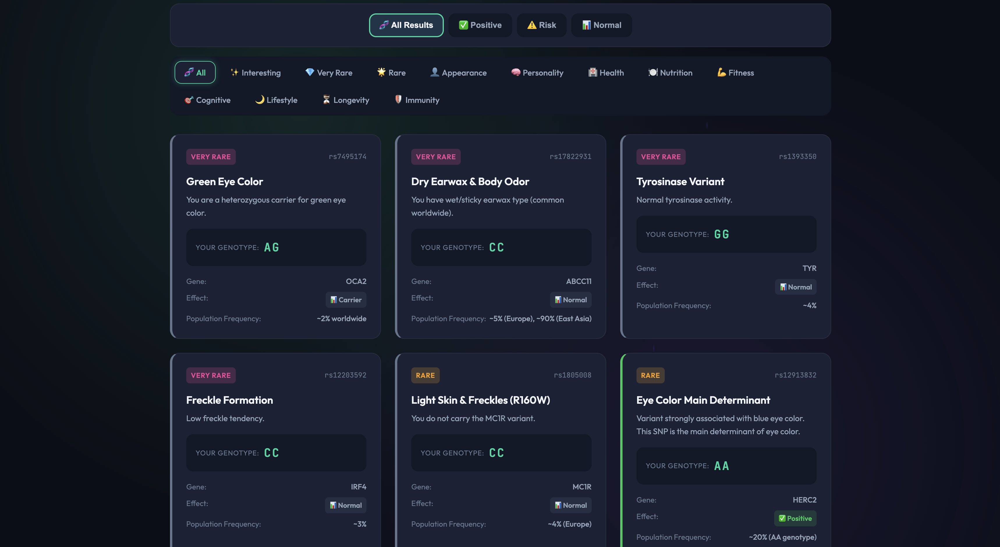

# 🧬 Easy DNA Data Extractor

## What is this project ?

It's simply extracting meaningful easy to understand data from your DNA data.

A free alternative to 23andMe & MyHeritage Reports.

Examples:
Diabetes risk,
Caffeine Metabolism,
Emotional Intelligence,
Sleep Pattern.

<!-- Replace screenshot.png with your actual screenshot file -->

## Motivation

DNA analysis services like **MyHeritage** charge **$19** for health reports, and other platforms have their own (often higher) pricing tiers. I wanted to create a **free alternative** that anyone can use without paying these fees.

## Supported DNA Data Format

- 23andMe
- MyHeritage
- FamilyTreeDNA
- LivingDNA
- AncestryDNA

##  Disclaimer

I don't have deep expertise in genetics or bioinformatics. This tool is built based on publicly available SNP research and databases.

**If you notice any mistakes or inaccuracies:**
- Please open an issue to let me know
- Or submit a Pull Request to fix it

I appreciate any corrections from people with more knowledge in this field!

##  Contributing

Want to add more features or improve the analysis? **Pull requests are welcome!**

Some ideas:
- Add more SNP associations
- Improve the UI/UX
- Add new trait categories
- Fix any scientific inaccuracies
- Improve documentation

Feel free to fork, modify, and submit PRs!

##  License

Open source - feel free to use and modify.
